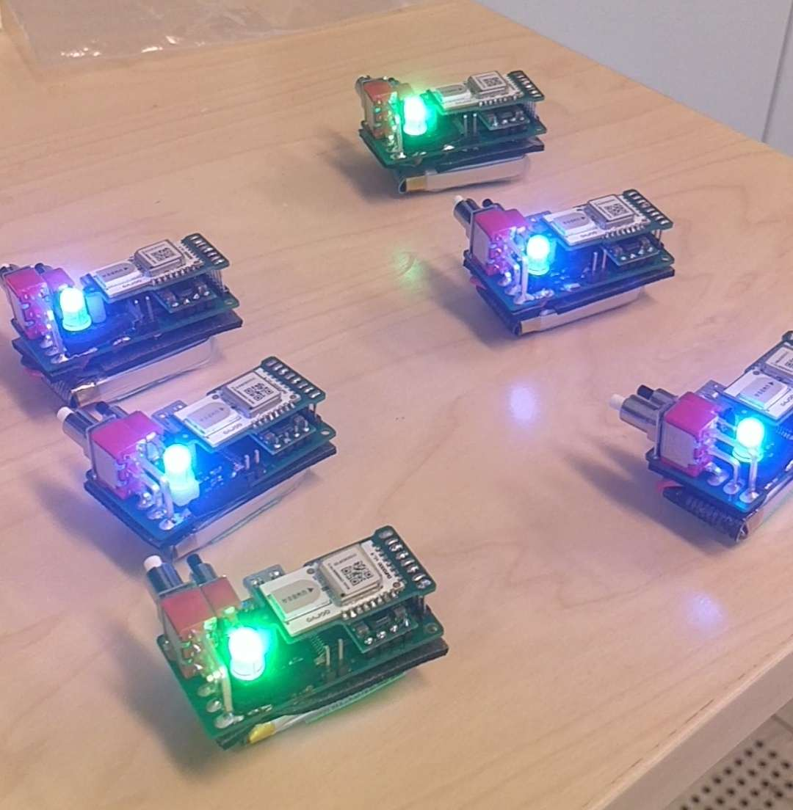

# NCS UWB beacon
The beacons can help another node to position itself by transmitting their position and distance. 
A minimum of 4 beacons are needed to uniquely calculate the position in 3D space but more will increase the accuraccy.

## how to use
### usage
A typical beacon system will consist of the following nodes:
* 1x origin-beacon (mandatory)
* 1x X-beacon (mandatory)
* 1x Y-beacon (mandatory)
* 1x Z-beacon (mandatory)
* Nx repeater beacons (optional)

The X, Y, Z and origin-beacons are mandatory and span the coordinate system. The distance at which they are placed is not important other than for a few best practices. Repeater beacons are optional and only exist to improve the performance. All beacons must be assigned an uint8 ID that is globally unique over the WHOLE uwb system, so not just beacons but i.e. Durin robots as well.

A fourth mode, passive, is also available. Intended to be used on for example moving objects. The beacon will become a part of the positioning system but it will still report its distance to whoever polls it.

### calibration
The beacons are almost entirely self calibrating. The only thing that needs special care is ensuring that all axises are in the proper order and orthogonal. To calibrate the system press the small button and you should see all beacons turn yellow. Then you have a few seconds to get out of the way. The beacons really hate having a big human filled with water obstructing their view.

If everything is in order then one beacon will show white which means that it is currently being calibrated. Each beacon takes in the order of 10 seconds to calibrate.

Once all beacons are calibrated they will all show green.

If the beacons turn pink after a few seconds the calibration has failed. Most likely because one of the 4 mandatory beacons are missing.

### configuration
The beacons have a ft232 connected to the USB port which is used for configuration. The UART paramters are the following (usually the defaults for almost all setups I have used).

* 115200 baud
* 8 data bits
* no parity bit
* 1 stop bit

It runs a normal console and some of the things you can configure are.
* node id
* beacon mode
* wifi on/off (should only be on for debugging)

run `help` for exact details

### best practices 

The UWB radio is **very** sensitive to obstructions and multi-pathing. The beacons must have line of sight to get proper distance measurements. This effects how the beacons must be oriented since the signal can not pass through the PCB and battery. Ensure that all antennas face towards each other.

The x,y and z beacons must see the origin beacon. A repeater beacon needs to see the x,y,z and origin beacons. The user robot needs to see all beacons it intends to poll (presumably all of them). One small takeaway from this is that the repeaters do not necessarily need to see each other.

The UWB antenna is linearly polarized which means that all beacons should ideally have their antennas parallell to each other. The antenna's signals are also strongest in the direction orthogonal to the antenna. For standing beacons this doesn't have much significance since up is always up no matter the heading. 

For lying beacons on the other hand it can cause problems since there is no universal "forward" direction. A good idea can be to place beacons at rotating angles to ensure that i.e. a central robot always has an "ok" signal.


```
poor reception
|

|
```
```
poor reception
| --
```
```
good reception
|    |
```
```
"ok" reception
/     \         
   |
\     /
"ok"
/     \         
   \
\     /
"ok"
/     \         
   --
\     /
```

## developer guide
### overview
The system is built around sending packets back and forth. A "tick" is 1ms and is what the system is aligned after. The distance is measured through the time of flight of the message. Messages can either be addressed individually in which case the addressed node should respond within one tick or broadcasted where all nodes get assigned a timeslot to respond based on their node ID. Beacons are only allowed to actively send messages when they are in configuration mode or the network is idle. User nodes can freely send messages whenever they want.

### messages
* poll ranging
    * sends a request to poll the distance between a node 
* response ranging
    * response for ranging request containing position, flags, node info e.t.c (the distance can then be calculated)
* poll alive
    * all nodes respond with an is alive
* is alive
    * response to poll alive
* give word
    * used by the origin beacon to give another beacon the right to freely use the airspace without collisions.
* system status
    * sets a new system status for the network e.g. CONFIGURING, ERROR, ALL GOOD
* quiet
    * requests all nodes to be quiet for a specified amount of time. Used to prevent collisions in multi user scenarios

### usage
a typical usage scenario would look be.

At boot spam `quiet` messages until everyone is quiet to prevent any further collisions. Then send a `poll alive` broadcast message and record all responses. Then start sending `poll ranging` messages to all nodes you find interesting. If there are multiple user nodes in the system the ticks should be arranged in a round-robin fashion.

### protocol
see `include/uwb_definitions.h` for the exact protocol, timings, and details. All structs are tightly packed and in little endian.